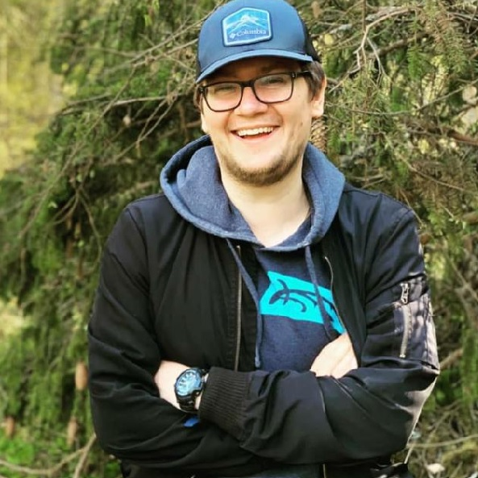

## Привет! Меня зовут Василий Рязанов!

Последние 8 лет я работаю в сфере эксплуатации и строительства и я устал работать со старыми и скучными людьми, ведь еще чуть чуть и я сам стану таким. И не смотря на то, что на текущем месте я достиг определенных высот и зарплатного уровня, я решил освоить новую профессию для того, что бы в первую очередь поменять профессиональный круг общения. 
Мне 34 года, и, конечно, я не думаю, что это будет легко, но я приложу максимум усилий, что бы время, потраченное на обучение, не прошло даром. 
На данный момент идёт второй месяц моего обучения новой профессии, я всё ещё полон энтузиазма, более того - чем больше я практикуюсь, тем больше мне это нравится. Удивительно как задача, над которой часами ломаешь голову, решается в первые 5 минут работы над ней же на следующий день. Очень приятные ощущения :) 

Это, кстати, страница "Обо мне", сделанная в рамках моего домашнего задания на модуле "GIT - системя контроля версий" на Нетологии. Изучаем GitHub Pages)) 

